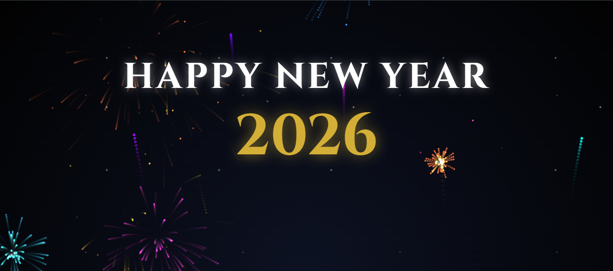

# 🎄 New Year 2026 | Premium Edition



A high-end, immersive New Year's Eve countdown experience featuring 3D animations, dynamic visuals, and a luxury aesthetic.

## ✨ Overview

This project is a premium web-based countdown animation designed to celebrate the transition into **2026**. Built with a focus on visual excellence, it combines modern web technologies with advanced animation libraries to create a festive and elegant user experience.

## 🚀 Key Features

- **Interactive 3D SVG Tree**: A beautifully animated Christmas tree powered by GSAP, featuring particle effects and smooth transformations.
- **Dynamic Countdown Timer**: A high-precision timer displaying days, hours, minutes, and seconds, styled with a luxury gold and charcoal palette.
- **Immersive Environment**:
  - High-fidelity **starfield background** with parallax-style motion.
  - **Glassmorphism UI** for a modern, sleek feel.
- **Celebration Mode**: When the countdown hits zero, the interface transitions into a celebration state:
  - Spectacular **Fireworks Display** using HTML5 Canvas.
  - Epic typography animations for the "Happy New Year 2026" message.
- **Responsive Design**: Optimized for everything from high-resolution desktops to mobile devices.

## 🛠️ Technologies Used

- **HTML5**: Semantic structure and Canvas for high-performance graphics.
- **CSS3**: Advanced animations, Keyframes, Flexbox, and Custom Properties (Variables).
- **JavaScript (ES6+)**: Core logic for the countdown and celebration sequencing.
- **GSAP (GreenSock Animation Platform)**: Professional-grade animations for the SVG tree and particle systems.

## 📁 Project Structure

- `index.html`: The main entry point and UI structure.
- `styles.css`: Premium styling, layouts, and CSS animations.
- `script.js`: Interactive logic, countdown mechanism, and GSAP animations.
- `Capture.png`: The featured project screenshot.

## 💻 Setup & Installation

To run this project locally, simply clone the repository and open `index.html` in any modern web browser.

```bash
# Clone the repository
git clone https://github.com/charaf12-u/Christmas-2026-Animation.git

# Navigate to the project directory
cd Christmas-2026-Animation

# Open index.html in your browser
# (Or use a Live Server extension in VS Code)
```

## 🎨 Design Philosophy

The design aims for a **luxury, premium feel**. The combination of the `Cinzel` serif font (classic elegance) and `Lato` sans-serif (modern clarity), paired with a deep midnight background and golden accents, ensures a high-end visual impact suitable for a special New Year's celebration.

---

*Happy New Year 2026!* 🥂
